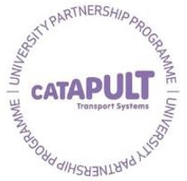

News
[Come and join us at TSC IMAGINE 2017](post-imagine-demo.html)

<a href="https://twitter.com/share" class="twitter-share-button" data-show-count="false">Tweet</a>

## Objective

This project aims to develop a standard set of microsimulation models and test configurations for the evaluation of traffic control systems. We are also developing an API to enable the straightforward connection of your traffic control system. You should consider using this standard test set to evaluate your traffic control system because it will enable you to benchmark the performance of your system against many others on a level playing field.

## Collaboration

This project is part of the [Transport Systems Catapult](https://ts.catapult.org.uk/)'s **University Partnership Programme** with the [Transportation Research Group at the University of Southampton](http://www.southampton.ac.uk/engineering/research/groups/transportation_group.page).

## Acknowledgments

 - Some of the models included in this project was hosted at [http://tctester.sourceforge.net/](http://tctester.sourceforge.net/).
 - References to [SUMO's wiki](http://sumo.dlr.de/wiki/Simulation_of_Urban_MObility_-_Wiki) including tutorials and documentasions are also referenced extensively in our documentations.


